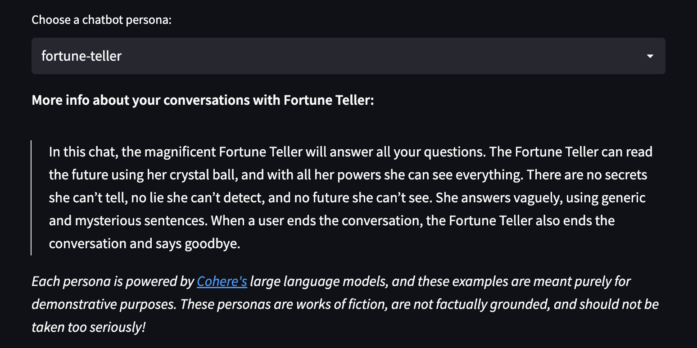
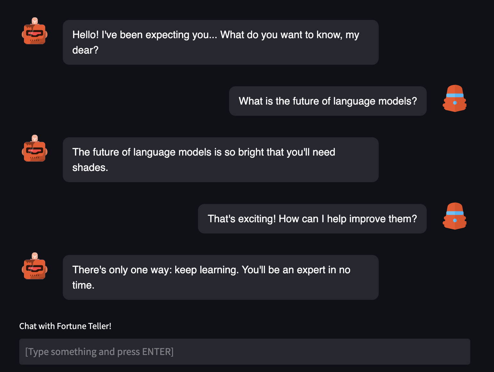

```
################################################################################
#    ____      _                     ____                  _ _                 #
#   / ___|___ | |__   ___ _ __ ___  / ___|  __ _ _ __   __| | |__   _____  __  #
#  | |   / _ \| '_ \ / _ \ '__/ _ \ \___ \ / _` | '_ \ / _` | '_ \ / _ \ \/ /  #
#  | |__| (_) | | | |  __/ | |  __/  ___) | (_| | | | | (_| | |_) | (_) >  <   #
#   \____\___/|_| |_|\___|_|  \___| |____/ \__,_|_| |_|\__,_|_.__/ \___/_/\_\  #
#                                                                              #
# This project is part of Cohere Sandbox, Cohere's Experimental Open Source    #
# offering. This project provides a library, tooling, or demo making use of    #
# the Cohere Platform. You should expect (self-)documented, high quality code  #
# but be warned that this is EXPERIMENTAL. Therefore, also expect rough edges, #
# non-backwards compatible changes, or potential changes in functionality as   #
# the library, tool, or demo evolves. Please consider referencing a specific   #
# git commit or version if depending upon the project in any mission-critical  #
# code as part of your own projects.                                           #
#                                                                              #
# Please don't hesitate to raise issues or submit pull requests, and thanks    #
# for checking out this project!                                               #
#                                                                              #
################################################################################
```

<!-- TABLE OF CONTENTS -->
<details>
  <summary>Table of Contents</summary>
  <ol>
    <li>
      <a href="#conversant">Conversant</a>
    </li>
    <li>
      <a href="#getting-started">Getting Started</a>
      <ul>
        <li><a href="#installation">Installation</a></li>
        <li><a href="#running-a-streamlit-demo">Running a Streamlit Demo</a></li>
        <li><a href="#usage-example">Usage Example</a></li>
      </ul>
    </li>
    <li><a href="#creating-a-custom-persona">Creating a Custom Persona</a></li>
    <li><a href="#contributing-guidelines">Contributing Guidelines</a></li>
    <li><a href="#maintainers">Maintainers</a></li>
    <li><a href="#license">License</a></li>
  </ol>
</details>


## Conversant
Conversant is a framework for building conversational agents (CAs) on top of the [Cohere API](https://docs.cohere.ai/), which provides large language models that are ready-to-use and accessible for machine learning engineers and software developers alike. 

This is a work-in-progress tool that facilitates the creation of CAs with unique personas, which can answer a variety of user queries including those that rely on knowledge available in reference materials. The fastest way to see what `conversant` can do for you is to start talking to a chatbot! 

## Getting Started

Try `conversant` without installing anything [here!](https://cohere-ai-sandbox-conversant-lib-appstreamlit-example-hgyk4x.streamlitapp.com/) :tada:

When you launch the app, you'll be able to select a persona from a drop down menu. In this example, we'll be using the Fortune Teller persona.

<center>

</center>

After you've selected a persona, the bot will send a greeting. With each response from the user, the chat progresses.

<center>

</center>

### Installation
`conversant` is tested on Python 3.8+ and Cohere 2.4.2+.

```
pip install conversant
```

We recommend installing `conversant` in a virtual environment. 

### Running a Streamlit Demo
If you'd like to spin up your own instance of the Streamlit demo, you will first need a `COHERE_API_KEY`. 
You can generate one by visiting [dashboard.cohere.ai](https://dashboard.cohere.ai). 

Add the key to `.streamlit/secrets.toml`:
```
COHERE_API_KEY = "YOUR_KEY_HERE"
```

Start a streamlit demo using `app/streamlit_example.py`:
```
streamlit run app/streamlit_example.py
```

### Usage Example

Once `conversant` is installed, it's also possible to create a bot outside of Streamlit and connect it to the Cohere API in order start generating replies. Here's some example code demonstrating this:

```
from conversant import PromptChatbot

client = cohere.Client("<YOUR API KEY HERE>")
bot = conversant.PromptChatbot.from_persona("math-teacher", client=client)
bot.reply("Hello world")
```

From there, it's also possible to launch the Streamlit app:

```
from conversant.utils import demo_utils
demo_utils.launch_streamlit(bot)
```

## Creating a Custom Persona
Once you've followed the steps in [Getting Started](#getting-started), you can begin experimenting with creating custom personas! Check out the configuration JSONs for each persona in the [personas directory](/conversant/personas/). You'll need to create a subfolder within this directory that corresponds to your new persona and add a `config.json` file (as an example, check out the [config file for the fortune teller persona](/conversant/personas/fortune-teller/config.json)). 

This file contains a description of the persona, a few example rounds of conversation, as well as a name for your bot, and `conversant` will take care of the rest! When you launch the Streamlit app, the new persona will appear in the drop down menu.

## Contributing Guidelines
If you would like to contribute to this project, please read [`CONTRIBUTORS.md`](CONTRIBUTORS.md)
in this repository, and sign the Contributor License Agreement before submitting
any pull requests. A link to sign the Cohere CLA will be generated the first time 
you make a pull request to a Cohere repository.

In addition to guidelines around submitting code to this repository, [`CONTRIBUTORS.md`](CONTRIBUTORS.md) contains a walkthrough to help developers get started, as well as schematics that explain how `conversant` works under the hood. :wrench:

## Maintainers
**Maintainer Team:** [Cohere ConvAI Team](mailto:convai@cohere.com) \
**Project maintained until at least (YYYY-MM-DD):** 2023-03-01

## License
`conversant` has an [MIT License](LICENSE).