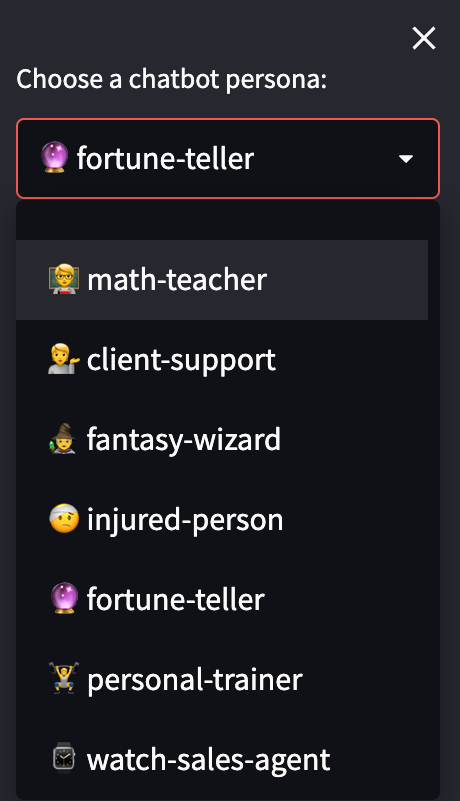

```
################################################################################
#    ____      _                     ____                  _ _                 #
#   / ___|___ | |__   ___ _ __ ___  / ___|  __ _ _ __   __| | |__   _____  __  #
#  | |   / _ \| '_ \ / _ \ '__/ _ \ \___ \ / _` | '_ \ / _` | '_ \ / _ \ \/ /  #
#  | |__| (_) | | | |  __/ | |  __/  ___) | (_| | | | | (_| | |_) | (_) >  <   #
#   \____\___/|_| |_|\___|_|  \___| |____/ \__,_|_| |_|\__,_|_.__/ \___/_/\_\  #
#                                                                              #
# This project is part of Cohere Sandbox, Cohere's Experimental Open Source    #
# offering. This project provides a library, tooling, or demo making use of    #
# the Cohere Platform. You should expect (self-)documented, high quality code  #
# but be warned that this is EXPERIMENTAL. Therefore, also expect rough edges, #
# non-backwards compatible changes, or potential changes in functionality as   #
# the library, tool, or demo evolves. Please consider referencing a specific   #
# git commit or version if depending upon the project in any mission-critical  #
# code as part of your own projects.                                           #
#                                                                              #
# Please don't hesitate to raise issues or submit pull requests, and thanks    #
# for checking out this project!                                               #
#                                                                              #
################################################################################
```

**Maintainer:** [Cohere ConvAI Team](mailto:convai@cohere.com) \
**Project maintained until at least (YYYY-MM-DD):** 2023-03-01

# Conversant
[](https://github.com/cohere-ai/sandbox-conversant-lib/actions/workflows/run_tests.yaml/badge.svg) [](https://opensource.org/licenses/MIT)

Build conversational AI on top of [Cohere](https://cohere.ai/)'s [LLMs](https://docs.cohere.ai/generate-reference/)
- 🗣 Use large language models quickly
- 😃 Customizable personas
- 💁 Dialogue context
- 🪨 Responses grounded in your provided facts (soon!)
- 🐍 Install `conversant` with pip

`conversant` is a work-in-progress framework for building customizable dialogue agents (aka chatbots) that can answer questions and converse with users with a variety of different chatbot personas. `conversant` aims
to be modular, flexible and extensible so you can create any kind of chatbots you want!

Read the [launch blog post]() and [threads]().

Try `conversant` on our Streamlit app [here](https://cohere-ai-sandbox-conversant-lib-appstreamlit-example-hgyk4x.streamlitapp.com/). 🎉

## Table of Contents
1. [Installation and Usage](#installation-and-usage)
   1. [Installation](#installation)
   2. [Streamlit Demo](#streamlit-demo)
   3. [Running Your Own Demo Locally](#running-your-own-demo-locally)
   4. [Usage](#usage)
2. [How Conversant Works](#how-conversant-works)
3. [Creating a Custom Persona](#creating-a-custom-persona)
4. [Editing a Persona on the Demo](#editing-a-persona-on-the-demo)
5. [Contributing Guidelines](#contributing-guidelines)
6. [Maintainers](#maintainers)
7. [License](#license)

## Installation and Usage

### Installation

`conversant` is available on PyPI, and is tested on Python 3.8+ and [Cohere](https://pypi.org/project/cohere/) 2.4.2+.
```
pip install conversant
```
### Streamlit Demo

Want to see it in action first? You can use `conversant` on a Streamlit demo without installing anything [here!](https://cohere-ai-sandbox-conversant-lib-appstreamlit-example-hgyk4x.streamlitapp.com/) 🎉

<p float="none">
  
  
</p>

<!-- When you launch the app, you'll be able to select a persona from a drop down menu. In this example, we'll be using the Fortune Teller persona.

After you've selected a persona, the bot will send a greeting. With each response from the user, the chat progresses.

The repository contains a few example personas, such as a sales agent :woman_office_worker:, a math teacher :teacher:, and a fantasy wizard :mage_woman:, but it is designed to be extensible, such that adding additional personas requires little more than a description and a few example interactions. These dialogue agents are based on the [Cohere API](https://docs.cohere.ai/), which provides large language models that are ready-to-use and accessible for machine learning engineers, data scientists, and software developers alike.

Dialogue agents have the potential to transform how humans engage with computers, including faster responses to support queries and free-form interactions with fictional characters, along with many other possibilities. The fastest way to see what `conversant` can do for you is to start talking to a chatbot!
Cohere uses Streamlit to create its demo applications. If you’re new to Streamlit, you can install it [here](https://docs.streamlit.io/library/get-started/installation) and read more about running Streamlit commands [here](https://docs.streamlit.io/library/get-started/main-concepts). -->

### Running Your Own Demo Locally

If you'd like to spin up your own instance of the Streamlit demo, you will first need a `COHERE_API_KEY`. 
You can generate one by visiting [dashboard.cohere.ai](https://dashboard.cohere.ai). 
Add the key to `.streamlit/secrets.toml`:
```
COHERE_API_KEY = "YOUR_API_KEY_HERE"
```

Start the streamlit app from `app/streamlit_example.py`:
```
streamlit run app/streamlit_example.py
```

### Usage

With `conversant`, you can create a chatbot powered by large language models with just the following code snippet.
```python
import cohere
from conversant import PromptChatbot

co = cohere.Client("YOUR_API_KEY_HERE")
bot = PromptChatbot.from_persona("fantasy-wizard", client=co)
bot.reply("Hello!")
>>> "Well met, fair traveller. What bringest thou to mine village?"
```

Once `conversant` is installed, it's also possible to create a chatbot outside of Streamlit and connect it to the Cohere API in order start generating replies. Here's some example code demonstrating this:

From there, it's also possible to launch the [Streamlit](https://docs.streamlit.io/) app:

```
from conversant.utils import demo_utils
demo_utils.launch_streamlit(bot)
```

## Creating a Custom Persona
Once you've followed the steps in [Getting Started](#getting-started), you can begin experimenting with creating custom personas! Check out the configuration JSONs for each persona in the [personas directory](/conversant/personas/). You'll need to create a subfolder within this directory that corresponds to your new persona and add a `config.json` file. The directory structure should look like this:

```
conversant/personas
├── fortune-teller
│   └── config.json
└── your-persona-name
    └── config.json
```

The config file contains a description of the persona, a few example rounds of conversation, as well as a name for your bot, and `conversant` will take care of the rest! As an example, check out the [config file for the fortune teller persona](/conversant/personas/fortune-teller/config.json). When you launch the Streamlit app, the new persona will appear in the drop down menu.

## Editing a Persona on the Demo

## Contributing Guidelines
If you would like to contribute to this project, please read [`CONTRIBUTORS.md`](CONTRIBUTORS.md)
in this repository, and sign the Contributor License Agreement before submitting
any pull requests. A link to sign the Cohere CLA will be generated the first time 
you make a pull request to a Cohere repository.

In addition to guidelines around submitting code to this repository, [`CONTRIBUTORS.md`](CONTRIBUTORS.md) contains a walkthrough to help developers get started, as well as schematics that explain how `conversant` works under the hood. :wrench:

## License
`conversant` has an [MIT License](LICENSE).
